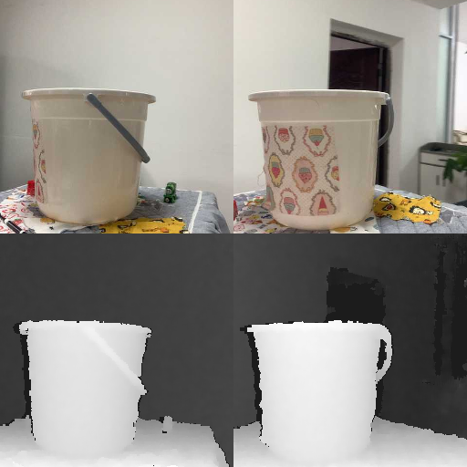

# NVS Renderer

| English | [Português](README_PT.md) |

An OpenGL renderer for 3D Novel View Synthesis (NVS) PyTorch models.

For now, it can render scenes from [VDST](https://github.com/gammag4/vdst).

Rendered scene:

https://github.com/user-attachments/assets/35a33c5e-fd6a-473b-b55a-ea6f4a667a93

Source images:



<!-- lvsm -->
<!-- https://github.com/user-attachments/assets/16de9309-e82a-4c30-a4e0-e8285eb4e954

https://github.com/user-attachments/assets/7071a7dc-cba4-410b-ab48-004afeadcf46 -->

## Usage

Install requirements:

- Some conda distribution (we recommend using [Miniforge](https://conda-forge.org/download/))
- NVIDIA drivers that support CUDA >= 13.0

Clone this repo:

```bash
git clone https://github.com/gammag4/nvs_renderer
cd nvs_renderer
```

Create conda environment:

```bash
conda create -n nvs_renderer python=3.13
conda activate nvs_renderer
conda install -c conda-forge ffmpeg
pip install -r requirements.txt
```

Clone [VDST](https://github.com/gammag4/vdst) to the folder `VDST` and follow instructions to configure it for inference, using the same conda environment.

Build and run:

```bash
python render.py --module renderers/vdst.py
```

Controls are WASD for forward, left, backward, right, left ctrl/space for down/up, mouse for camera movement and T for toggling depth map if there is one.
Press ESC once to unlock the mouse and press twice to close.

### Using with other models

#### As a module

To render using another model, import and use the function `render_model` with the following format:

```py
render_model(n_frames, initial_T, render, device, render_resolution, window_resolution=(800, 800))
```

Where:

- `n_frames: int`: Number of frames in the scene (should be 1 in the case of static NVS)
- `initial_T: tensor`: Initial 4x4 camera transformation matrix
- `render(T: tensor, frame_index: int) -> I: (tensor, tensor)`: A function that receives the current 4x4 camera transformation matrix and current frame index (which will be always zero in static NVS) and returns a tuple (image, depth) with the rendered image (shape `(C=3, H, W)`) and rendered depth as float in meters (or None if has no depth estimation) (shape `(H, W)`) at that position
- `device: str`: Which device to use (should be a CUDA device)
- `render_resolution: (int, int)`: Which resolution to use for rendering images (should have the same shape as `render(T)` output)
- `window_resolution: (int, int)`: (optional) Which resolution to use for the window

#### As a script

Crate a module similar to `renderers/vdst.py` that exports all the parameters described in the previous section.

Then do the usual configuration, build and run:

```bash
python render.py --module <path_to_your_module>
```
